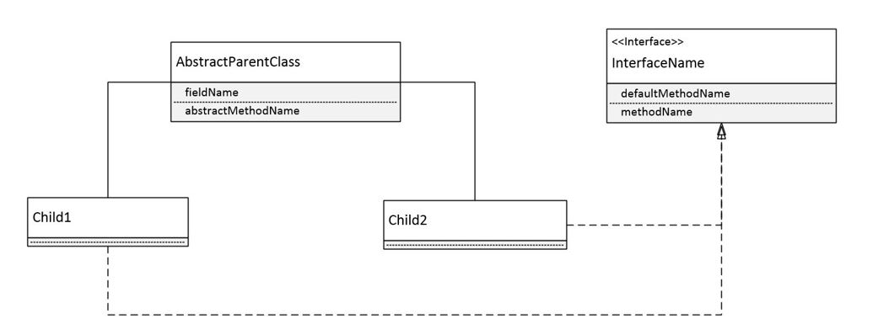

# Requirements #

Create a program that should the following entities:

1. The Abstract Class should have at least 2 fields, one abstract method and one implemented method.
2. The Interface should have at least one default method and one abstract method.
3. The Children classes should have at least 5 fields each.
4. The Children classes should have at least 2 custom Constructors each (non-default).
5. Use an Enum in the implementation.
6. Implement the next concepts: Encapsulation, Polymorphism, Override, Overload, Aggregation, Composition.

